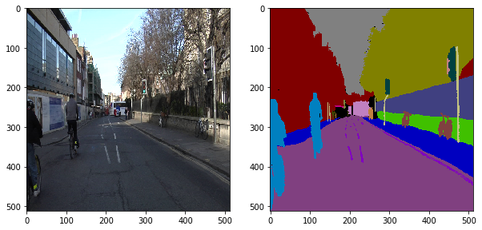

## LIVEOS - Live Video Object Segmentation System

## Overview

LIVEOS is a Live Video Object Segmentation System designed to provide real-time segmentation of objects in a video stream. The system utilizes advanced techniques in machine learning and computer vision to achieve accurate and efficient segmentation.

## Features

- Real-time object segmentation in live video streams.
- Utilizes machine learning algorithms for precise object identification.
- Seamless integration with various video sources.

## Getting Started

### Prerequisites

- Python (version 3.10)
- Dependencies (list dependencies or provide a link to requirements.txt)

### Installation

1. Clone the repository: `git clone https://github.com/pranjal2411/LIVEOS.git`
2. Navigate to the project directory: `cd LIVEOS`
3. Install dependencies: `pip install -r requirements.txt`

### Usage

1. Run the main notebook: `liveos.ipynb`
2. Follow on-screen instructions or customize settings as needed.

## Results

## Contributing

If you'd like to contribute to LIVEOS, please follow our [contribution guidelines](CONTRIBUTING.md).

## License

This project is licensed under the [MIT License](LICENSE).

